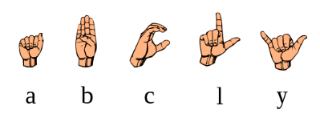
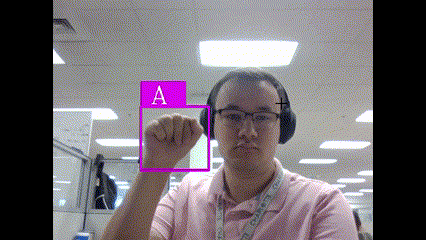

# Applied-AI-Robot                                                             

A small, two-wheeled robot that is controlled wirelessly by hand gestures. The gestures are based on American Sign Language (ASL) fore ease of use and available datasets. The AI currently runs on a Windows PC and uses a webserver hosted by the robot to convey the commands. The web server has different buttons for the currently available instructions (Stop, Forward, Backward, Left, Right).

# Controls

## Gestures
A -> Stop  
B -> Forward  
C -> Backward  
Y -> Right  
L -> Left

   
  

## L298N motor controller

| Input1  | Input2  | Spinning Direction |
| ------- | ------- | ------------------ |
| Low(0)	| Low(0)	| Motor OFF          |
| High(1) |	Low(0)  | Forward            |
| Low(0)  |	High(1) | Backward           |
| High(1) |	High(1) | Motor OFF          |

## Parts List
- ESP32 Development board
- TT Motor 200RPM
- L298N Motor Driver

# Future Development

In continued development of this project it would be great to transfer the AI from a PC to its own, dedicated embedded environemtn. This would allow the remote to be more portable, energy efficient, and compact. This change would require some changes to the controcl mechanism too, either implementing Bluetooth communication or RF.
